# SEGUNDA ATIVIDADE PB COMPASS


<div align="center">
  
</div>

## Descrição

A atividade consiste na instalação do "docker" ou "containerd" no host Ec2, em seguida efetuar o deploy de uma aplicação Wordpress dispondo de um RDS utilizando o Mysql, efetuar a configuração do serviço EFS (Elastic File System) para os estáticos do container da aplicação Wordpress e configurar o serviço de Load Balancer para a aplicação.

Observações:
- Não utilizar ip público para saída dos serviços Wordpress;
- Saída do tráfego de internet para o Load Balancer;
- Pastas públicas e estáticos do Wordpress armazenadas no EFS;
- Utilizar Dockerfile ou docker-compose;
- Necessário mostrar a aplicação Wordpress funcionando (tela de login);
- Aplicação exposta na porta 80 ou 8080;
- Utilizar repositório Git para versionamento;
- Criar documentação.

## Topologia

<div align="center">
  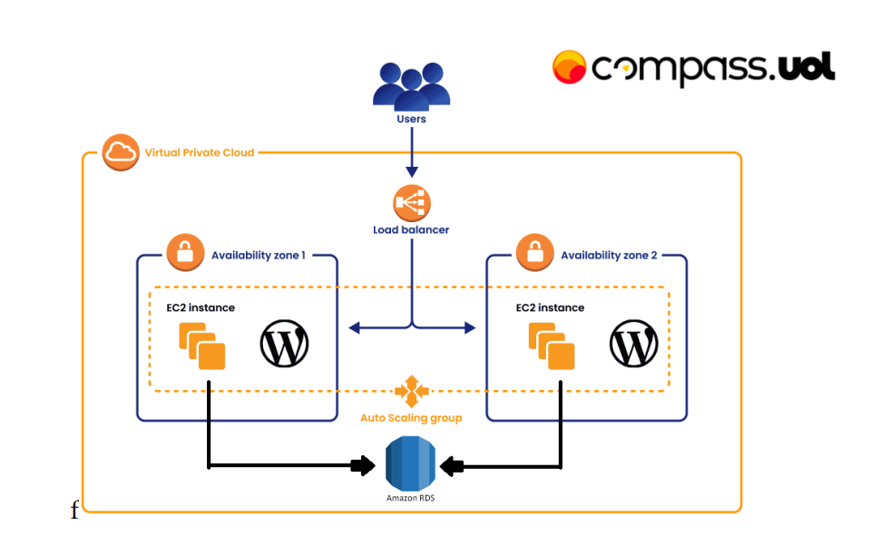
</div>

## Requisitos 

- Instalação e configuração do DOCKER ou CONTAINERD no host EC2;

Obs: Ponto adicional para o trabalho 
utilizar a instalação via script de 
Start Instance (user_data.sh)

- Efetuar Deploy de uma aplicação Wordpress com: container de aplicação RDS database Mysql;

- Configuração da utilização do serviço EFS AWS para estáticos do container de aplicação Wordpress;

- Configuração do serviço de Load Balancer AWS para a aplicação Wordpress.

Pontos de atenção:
- Não utilizar ip público para saída do serviços WP (Evitem publicar o serviço WP via IP Público);
- Sugestão para o tráfego de internet sair pelo LB  (Load Balancer Classic) o pastas públicas e estáticos  do wordpress sugestão de utilizar o EFS (Elastic File Sistem);
- Fica a critério de cada integrante usar Dockerfile  ou Dockercompose;

- Necessário demonstrar a aplicação wordpress  funcionando (tela de login)
- Aplicação Wordpress precisa estar rodando na porta 80 ou 8080;
- Utilizar repositório git para versionamento;
- Criar documentação.


## Criação através da Console

### 📌 Criação de VPC 📌
Para proporcionar um ambiente livre de falhas vou primeiro criar uma nova VPC para iniciar o projeto do zero.
Dentro do módulo de VPC vou optar pelo "VPC and More" e então alterar algumas partes:

Name => "wordpress",<br>
Number of AZ => 2, <br>
Number of Public Subnets => 2, <br>
Number of Private Subnets => 0, <br>
NAT Gateway => None, <br>
VPC Endpoint => None <br>


<div align="center">
  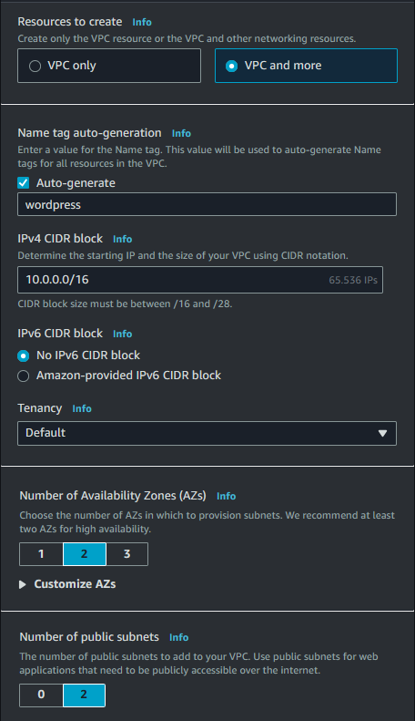
  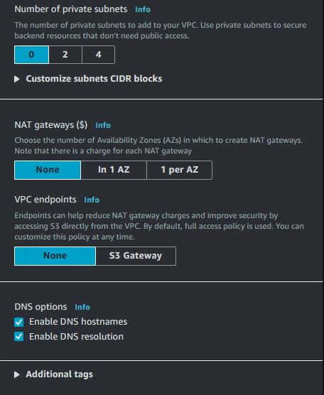
</div>

### 🔒 Security Groups 🔑
Durante esse processo eu vou criar os security groups que serão usados:

+ lb-sg-001 - Security Group para o Load Balancer:
  
  |Protocol| Type | Range | Source-type | Source     |
  |--------|------|-------|-------------|------------|
  |TCP     |HTTP  |80     |Anywhere     |0.0.0.0/0   |

<div align="center">
  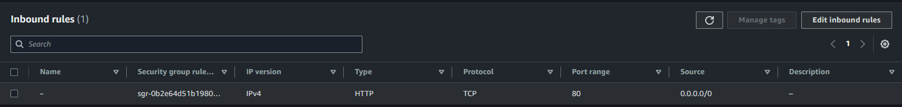
   <p><em>Security Group para o Load Balancer</em></p>
</div>


+  ec2-sg-001 - Security Group para as instâncias EC2:

  |Protocol| Type | Range | Source-type | Source     |
  |--------|------|-------|-------------|------------|
  |TCP     |SSH   |22     |My ip        |172.0.0.0/32|
  |TCP     |HTTP  |80     |Anywhere     |lb-sg-001   |

<div align="center">
  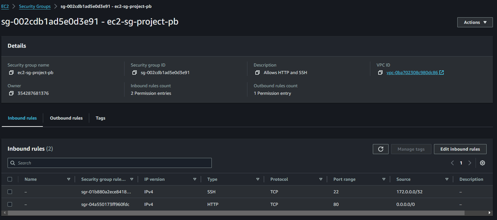
   <p><em>Security Group para a EC2</em></p>
</div>

+ rds-sg-001 - Security Group para o serviço de banco de dados com RDS:

  |Protocol| Type   | Range | Source-type | Source     |
  |--------|--------|-------|-------------|------------|
  |TCP     |MYSQL   |3306   |Anywhere     |0.0.0.0/0   |

<div align="center">
  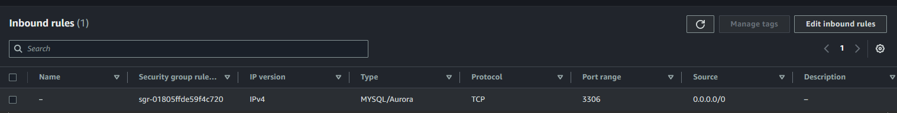
   <p><em>Security Group para o RDS</em></p>
</div>

+ efs-sg-001 - Security Group para o serviço de EFS:
 
  |Protocol| Type | Range | Source-type | Source     |
  |--------|------|-------|-------------|------------|
  |TCP     |NFS   |2049   |Custom       |ec2-sg-001  |

<div align="center">
  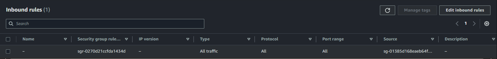
   <p><em>Security Group para o EFS</em></p>
</div>

### 📁 Elastic File System 📁

Em seguida vou criar o Elastic File System (EFS) que irá armazenar os arquivos estáticos do wordpress direcionando seus endpoints

Na tela de EFS vou configurar o nome como "wordpress" e a VPC que será usada no processo, com o EFS criado vamos configurar na aba de network o security group para o efs-sg-001 criado anteriormente.

<div align="center">
  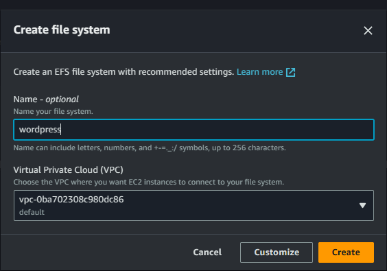
</div>


<div align="center">
  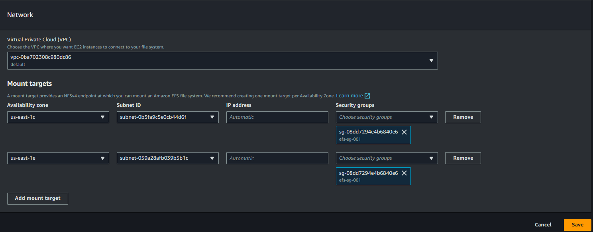
   <p><em>Aba "Network" do EFS</em></p>
</div>

###  ⚖️ Load Balancer (Classic) ⚖️

Nessa seção eu vou criar o Load Balancer Classic que será utilizado para acesso:

<div align="center">
  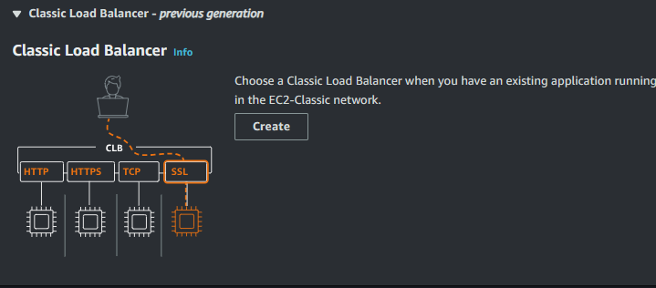
   <p><em>Classic Load Balancer</em></p>
</div>

O nome do Classic Load Balancer será "classic-load-balance-001" e escolher as duas subnets que as requisições serão balanceadas
<div align="center">
  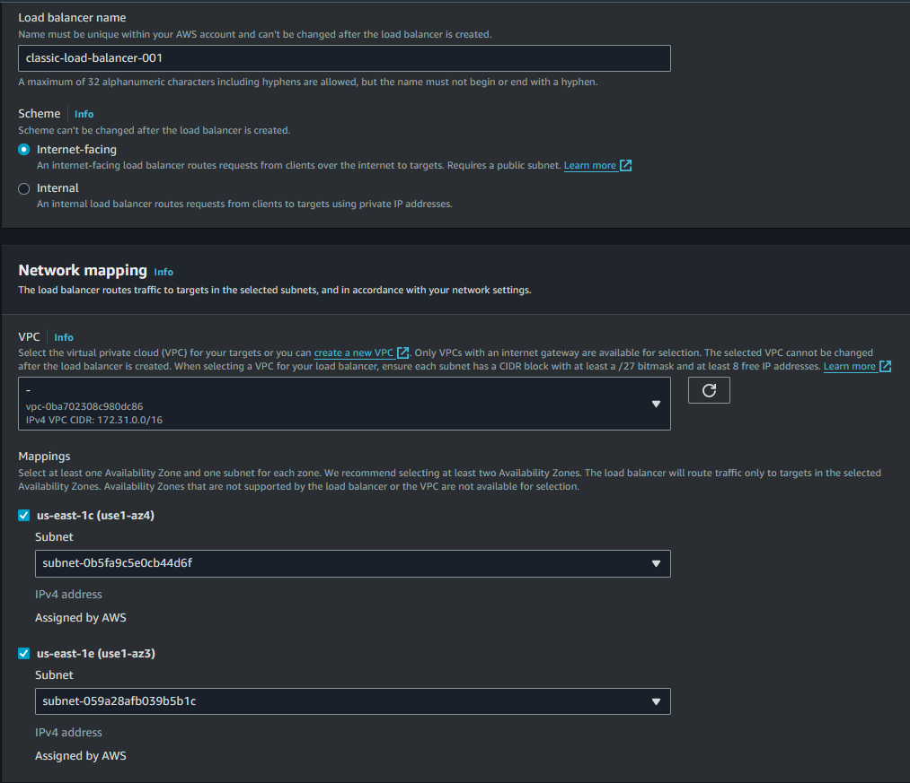
   <p><em>Classic Load Balancer</em></p>
</div>

No securtiy group vou adicionar o "lb-sg-001" criado anteriormente, e no "/wp-admin/install.php", a razão para optar por esse health-check é pela característica da atividade, como essa é uma rota que existe antes e depois do wordpress estar instalado na necessidade de apagar toda a estrutura e subir ela novamente vamos ter ela acessível e saudável para o health check antes mesmo de instalarmos o wordpress.

<div align="center">
  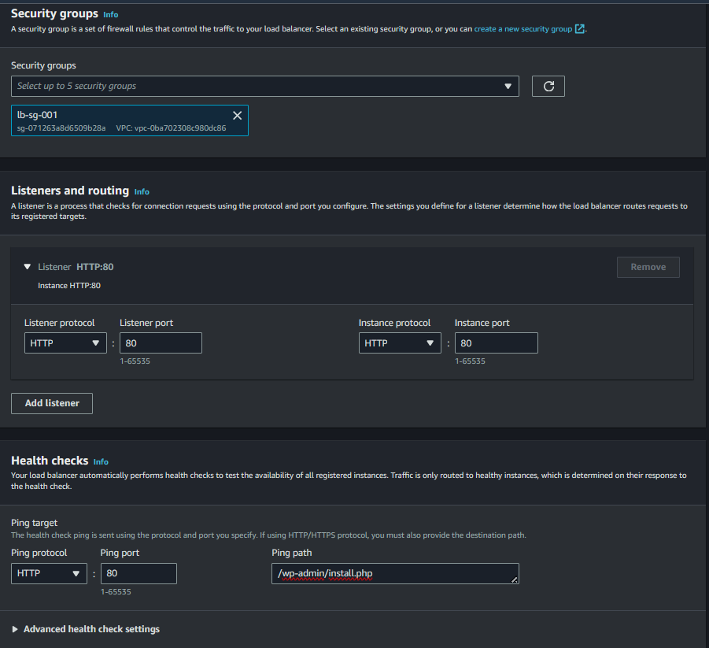
   <p><em>Classic Load Balancer</em></p>
</div>

### 🗄️ RDS (Banco de Dados) 🗄️

Nessa seção eu vou criar o banco de dados que será utilizado pelo container wordpress.

Eu vou primeiro entrar dentro do módulo de RDS dentro da AWS e clicar em "Create Database", dentro da tela de criação apenas algumas seções devem ser alteradas:

Engine Options => MySQL,</br>
Templates => Free tier</br>
Db Instance Identifier => wordpress-database,</br>
Master Password => { senha que desejar },</br>
Public Access => No, </br>
Vpc Security Group => rds-sg-001 </br>

<div align="center">
  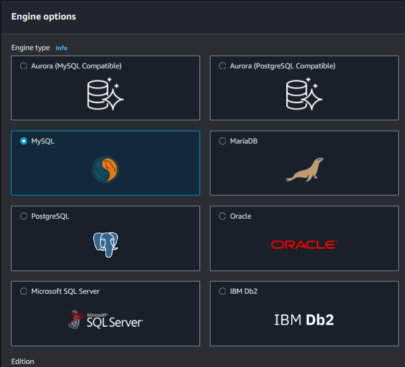
  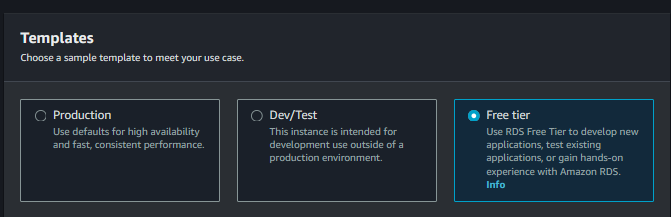
  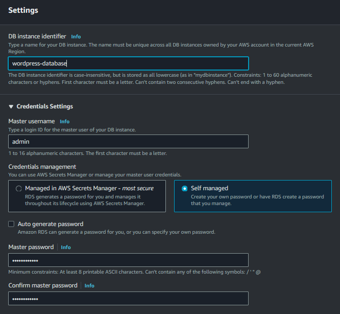
  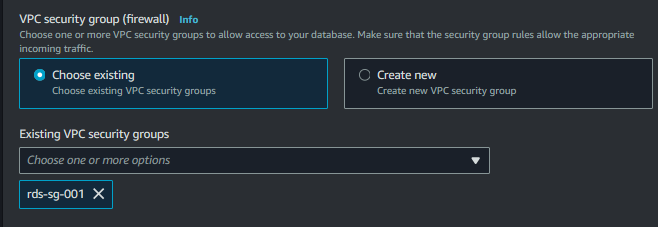
</div>


Na parte de "Additional Configuration" vamos colocar o initial database name como "Wordpress"

<div align="center">
  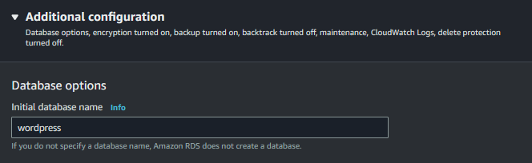
</div>

E então vamos criar o banco


### Launch Template e Key Pair
Nessa seção eu vou criar o Launch Template que será utilizado pelo auto-scaling.

Dentro do módulo de EC2 na seção de "Instances" um pouco abaixo é possível ver o "Launch Templates", em seguida vou configurar de acordo com as métricas pré-estabelecidas.

Launch template name => wordpress-template,</br>
AMI => Amazon Linux 2023 AMI,</br>
Instance Type => t3.small,</br>
Security Group => ec2-sg-001</br>

Exemplo:


Na seção de Key Pair vamos optar por criar um nova chave clicando na opção "Create new key pair"
<div align="center">
  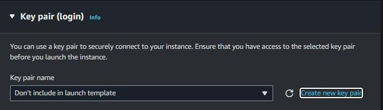
</div>


E então vou colocar um nome opcional no formato ".pem"
<div align="center">
  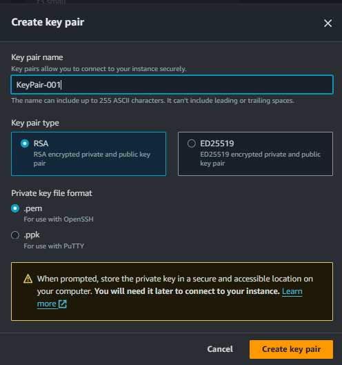
   <p><em>Launch Template</em></p>
</div>

Automaticamente a chave já será referenciada, mas no caso de não aparecer basta selecionar a chave criada.

Em "Resource Tags" adicionei as tags referentes ao PB para permitir a criação das instâncias e em "Advanced Details" no último campo adicionei o script user_data.sh adaptado ao meu ambiente.

## ⚙️ Auto Scaling Group ⚙️

Vou na seção de Auto Scaling Groups existente no módulo de Ec2 e vou optar pelo template criado no passo anterior

<div align="center">
  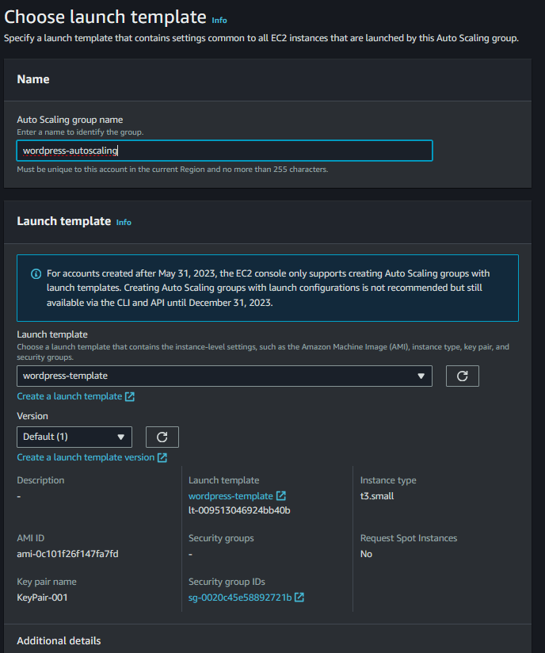
</div>

Na seção seguinte vou mapear as duas subnets onde nossas ec2 vão ficar

<div align="center">
  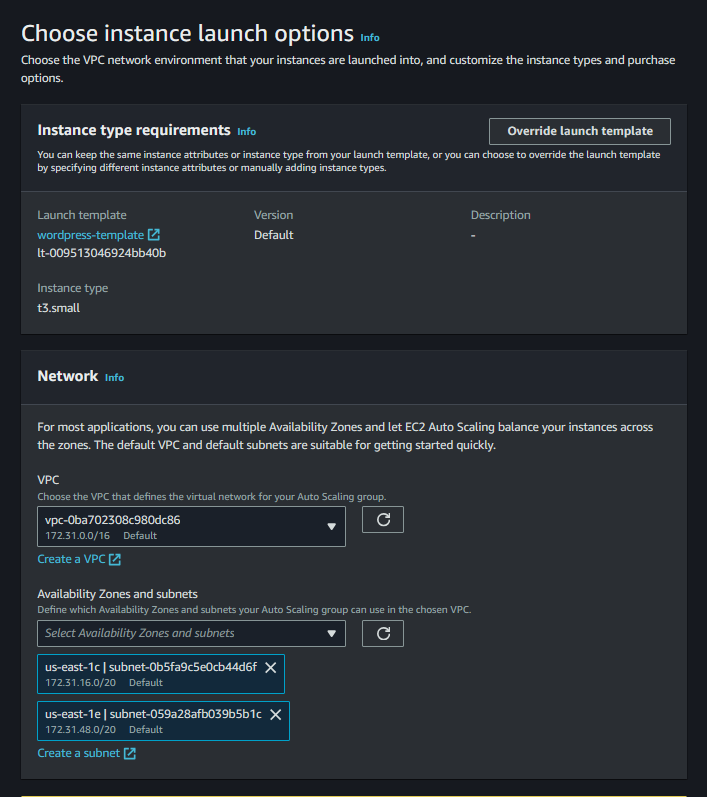
</div>

Na seção seguinte vou colocar o load balacing que criamos anteriormente (Classic Load Balancer)

<div align="center">
  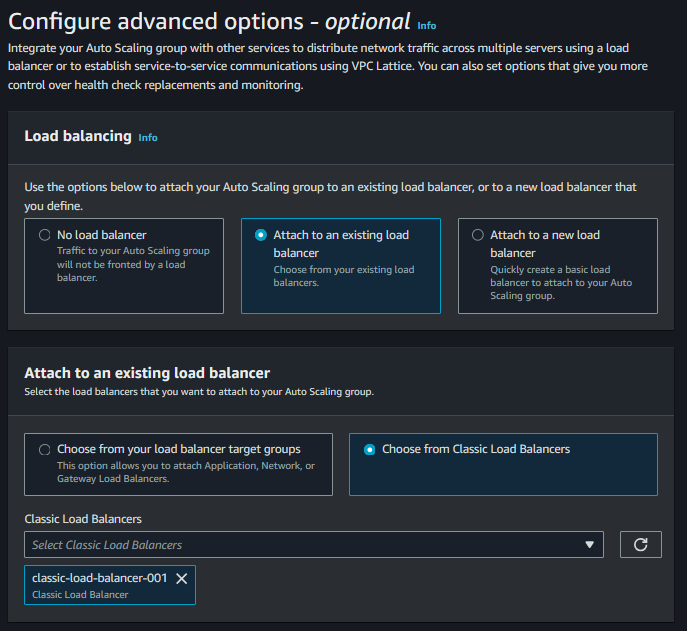
</div>

Na seção seguinte vou declarar as políticas de scaling, e então vamos finalizar a criação.
<div align="center">
  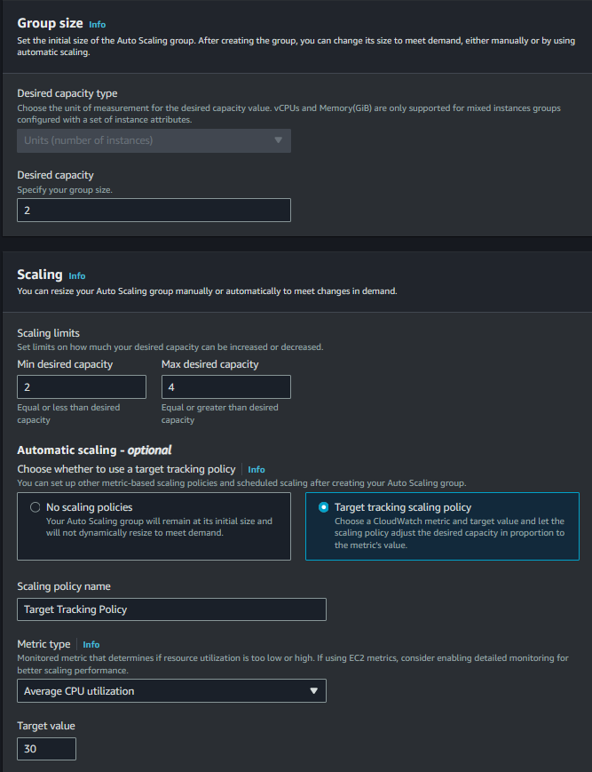
</div>

### 🖥️ Instalação do Wordpress 🖥️

Após alguns minutos as instâncias configuradas no scaling vão começar a subir e então eu vou instalar o wordpress e configurar a senha de admin e título da página.

<div align="center">
  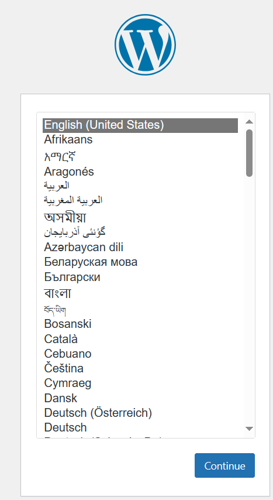
  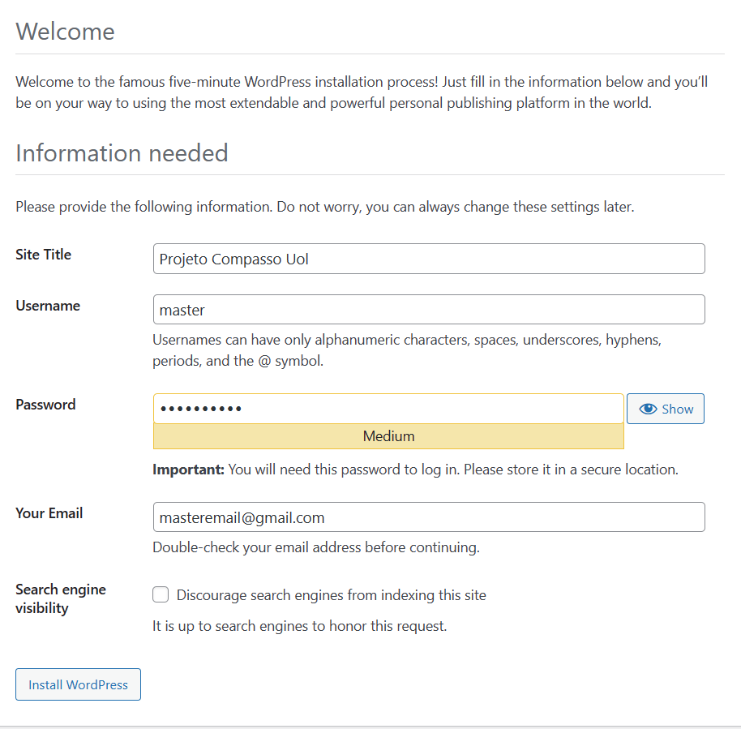
</div>

E ao acessar o DNS do Load Balancer eu consigo ter acesso ao site!

<div align="center">
  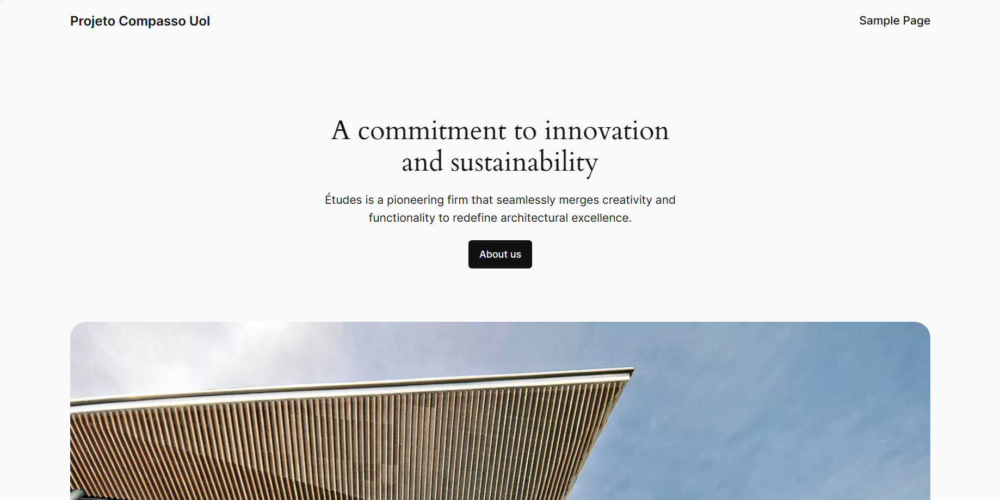
</div>

### 📚 Referências 📚
https://stackoverflow.com/questions/45193411/how-to-increase-aws-ec2-instance-cpu-utilization-to-100-to-test-autoscaling-gro

https://developer.hashicorp.com/terraform/tutorials/aws-get-started

https://registry.terraform.io/providers/aaronfeng/aws/latest/docs/resources
### ADICIONAIS 

#### 🚦 Teste de Scaling usando Stress 🚦
Após eu criar o auto-scaling group eu coloquei a sua policy para utilização de CPU em 30, significando que, sempre que ela atingisse 30% de seu uso uma nova instância seria criada para suprir essa demanda.

Obs: Vale lembrar que, em ambiente produtivo esse percentual seria um pouco maior, mas para observar isso em curto espaço de tempo eu vou usar somente 30%.

Primeiro eu vou entrar na instância através do comando de SSH:

```bash
ssh -i "local/da/chave" ec2-user@<id_publico_da_instancia>
```

E após adentrar eu vou rodar o seguinte comando:

```bash
stress -c 2
```

O comando acima significa que vamos estressar a cpu (flag c) sem tempo limite em 2 núcleos da cpu e então vou esperar alguns segundos até que a instância fique estressada e ative o autoscaling.

Alguns minutos depois terei 4 instâncias como foi solicitado no autoscaling

<div align="center">
  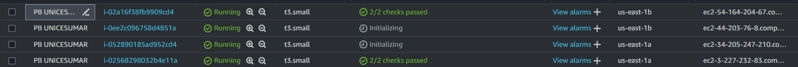
</div>


###   Terraform 

Esse módulo é um extra para a criação automática de toda a estrutura realizada no escopo da atividade:

Consiste na criação de: <br>
1 VPC; <br>
2 subnets; <br>
1 Internet Gateway; <br>
1 Route Table; <br>
1 RDS; <br>
4 Security Groups; <br>
1 Autoscaling Group;<br>
1 EFS;<br>
1 Autoscaling Policy; <br>
1 Launch Template; <br>
1 Classic Load Balancer. <br>

O código está disponível no repositório com o nome "main.tf", diante disso eu vou instalar o terraform disponível nesse link: https://developer.hashicorp.com/terraform/install

Antes de iniciar o terraform vou gerar uma chave pública e privada que vai ser referenciada na hora de criar a Key Pair da AWS para acesso às instâncias, vou abrir o terminal powershell e executar:

```bash
ssh-keygen -f .ssh\KeyPair001 
```

A partir daí dentro de um terminal vou até a pasta do repositório e então exportar as chaves das minhas credenciais AWS e em seguida executar o comando para iniciar o terraform

```bash
terraform init
```

Em seguida executar o comando para criação dos recursos na aws

```bash
terraform apply
```

Enfim vou ter a estrutura totalmente montada, um total de 22 recursos.

